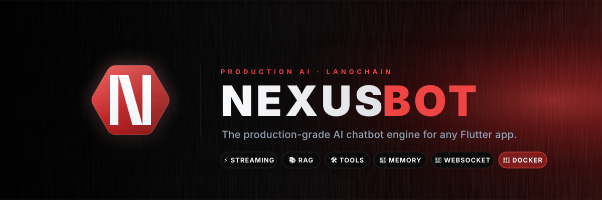
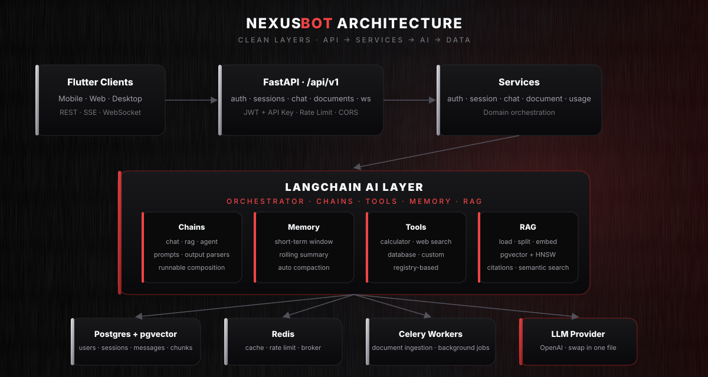
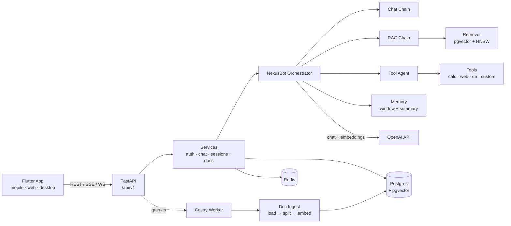

<div align="center">



<br/>

[](https://www.python.org/)
[](https://fastapi.tiangolo.com/)
[](https://www.langchain.com/)
[](https://www.postgresql.org/)
[](https://redis.io/)
[](https://www.docker.com/)
[](LICENSE)

<br/>

# NexusBot

**The production-grade AI chatbot engine for any Flutter app.**
**Built with FastAPI + LangChain. API-first, streaming-first, modular by design.**

[Quickstart](#-quickstart) · [Features](#-features) · [Architecture](#-architecture) · [API](#-api-reference) · [Flutter App](flutter_app/) · [Postman](postman/collection.json)

</div>

---

## ✨ Why NexusBot

Most "AI chatbot" repos are demos: one file, one model, no persistence, no streaming, no auth. The moment you try to ship one to a real Flutter app — with multiple users, document chat, real-time tokens, tool calls, and cost tracking — you have to rebuild it from scratch.

**NexusBot is the rebuild.** Drop it behind any Flutter app and you immediately get:

- 💬 Multi-session chat with persistent history & auto-generated titles
- ⚡ Real-time token streaming over **SSE** *and* **WebSocket**
- 📚 RAG over user-uploaded PDFs / DOCX / TXT / MD / HTML with citations
- 🛠 Tool calling (calculator, web search, custom DB tools — extensible registry)
- 🧠 Conversation memory with automatic rolling-summary compaction
- 🔐 JWT + revocable API keys, per-user rate limiting, structured errors
- 📊 Per-call AI usage logging with cost estimation
- 🐳 One-command Docker Compose deployment
- 📱 Flutter-ready: identical JSON event format across REST, SSE, and WS

---

## 🚀 Quickstart

```bash
git clone https://github.com/<your-user>/nexusbot.git
cd nexusbot

cp .env.example .env
# edit .env → set OPENAI_API_KEY and JWT_SECRET_KEY at minimum

docker compose up --build
```

Then open:

| Service | URL |
|---|---|
| API root        | http://localhost:8000/api/v1 |
| Swagger UI      | http://localhost:8000/api/v1/docs |
| ReDoc           | http://localhost:8000/api/v1/redoc |
| Liveness probe  | http://localhost:8000/api/v1/healthz |
| Readiness probe | http://localhost:8000/api/v1/readyz |

A 60-second end-to-end smoke test:

```bash
# 1. Register
curl -s -X POST localhost:8000/api/v1/auth/register \
  -H 'content-type: application/json' \
  -d '{"email":"a@b.com","password":"demopassword"}'

# 2. Login → grab access_token from the response
TOKEN=$(curl -s -X POST localhost:8000/api/v1/auth/login \
  -H 'content-type: application/json' \
  -d '{"email":"a@b.com","password":"demopassword"}' | jq -r .access_token)

# 3. Create a session
SID=$(curl -s -X POST localhost:8000/api/v1/sessions \
  -H "authorization: Bearer $TOKEN" -H 'content-type: application/json' \
  -d '{}' | jq -r .id)

# 4. Talk to NexusBot
curl -s -X POST localhost:8000/api/v1/sessions/$SID/messages \
  -H "authorization: Bearer $TOKEN" -H 'content-type: application/json' \
  -d '{"content":"What can you do?"}' | jq
```

---

## 🧩 Features

<table>
<tr>
<td width="50%" valign="top">

### 💬 Chat
- Multi-session, multi-user
- Persistent history (cursor pagination)
- Auto-generated conversation titles
- Regenerate last response
- Full-text search across all chats

</td>
<td width="50%" valign="top">

### ⚡ Streaming
- Server-Sent Events (`/messages/stream`)
- WebSocket (`/ws/sessions/{id}`)
- **Identical JSON event format** on both
- Tokens, citations, tool calls, usage, done
- Heartbeat / ping support on WS

</td>
</tr>
<tr>
<td valign="top">

### 📚 RAG
- File upload → async ingest via Celery
- PDF · DOCX · MD · HTML · TXT
- pgvector with HNSW cosine index
- Configurable chunk size / overlap / top-k
- Inline `[doc:NAME#chunk]` citations

</td>
<td valign="top">

### 🛠 Tool Calling
- LangChain agent (OpenAI tools)
- Built-in: calculator, web search, DB query
- Registry pattern — add a tool in 1 file
- Per-call audit log (`tool_calls` table)
- Tool events streamed to the client

</td>
</tr>
<tr>
<td valign="top">

### 🧠 Memory
- Windowed short-term history (configurable)
- Long-term rolling summary per session
- Auto-compaction when token budget exceeded
- Token-aware via `tiktoken`

</td>
<td valign="top">

### 🔐 Auth & Security
- JWT (access + refresh) with bcrypt
- Revocable API keys (SHA-256 hashed at rest)
- Redis token-bucket rate limiting
- Pydantic input validation everywhere
- Structured error envelope

</td>
</tr>
<tr>
<td valign="top">

### 📊 Observability
- Structured JSON logs (structlog)
- Optional Sentry integration
- AI usage logging with cost estimate
- `X-Process-Time-Ms` on every response
- Liveness + readiness probes

</td>
<td valign="top">

### 🐳 Deployment
- One `docker compose up`
- API + worker + beat + Postgres + Redis
- Alembic migrations
- Async SQLAlchemy 2 with connection pooling
- Scales horizontally

</td>
</tr>
</table>

---

## 🏗 Architecture

<div align="center">

</div>



### Layered design — strictly one-way dependencies

```
┌────────────────────────────────────────────────────┐
│  app/api/v1     ← HTTP / SSE / WS layer            │
├────────────────────────────────────────────────────┤
│  app/services   ← business logic, transactions     │
├────────────────────────────────────────────────────┤
│  app/ai         ← LangChain orchestrator + chains  │
├────────────────────────────────────────────────────┤
│  app/models     ← SQLAlchemy ORM (UUIDs, soft-del) │
└────────────────────────────────────────────────────┘
```

**Principles applied:** Clean Architecture · SOLID · Dependency Injection (FastAPI `Depends`) · single LLM/embedding/vector swap point · zero coupling between API and LangChain.

---

## 📡 API Reference

> Full reference in [`docs/api.md`](docs/api.md) · Importable Postman collection: [`postman/collection.json`](postman/collection.json)

All authenticated endpoints accept **either** `Authorization: Bearer <jwt>` **or** `X-API-Key: <key>`.

### Auth
| Method | Endpoint | Purpose |
|---|---|---|
| `POST`   | `/auth/register`           | Create account |
| `POST`   | `/auth/login`              | Login → JWT pair |
| `POST`   | `/auth/refresh`            | Refresh access token |
| `GET`    | `/auth/me`                 | Current user profile |
| `POST`   | `/auth/api-keys`           | Mint API key (shown once) |
| `DELETE` | `/auth/api-keys/{id}`      | Revoke API key |

### Sessions
| Method | Endpoint | Purpose |
|---|---|---|
| `POST`   | `/sessions`                | Create session |
| `GET`    | `/sessions`                | List (paginated) |
| `GET`    | `/sessions/{id}`           | Get one |
| `PATCH`  | `/sessions/{id}`           | Update title / system prompt |
| `DELETE` | `/sessions/{id}`           | Soft delete |

### Chat
| Method | Endpoint | Purpose |
|---|---|---|
| `POST` | `/sessions/{id}/messages`             | Send & receive (blocking) |
| `POST` | `/sessions/{id}/messages/stream`      | **SSE stream** |
| `POST` | `/sessions/{id}/messages/regenerate`  | Regenerate last turn |
| `GET`  | `/sessions/{id}/messages`             | History (cursor pagination) |
| `POST` | `/search`                             | Full-text search |
| `WS`   | `/ws/sessions/{id}?token=...`         | **WebSocket stream** |

### Documents (RAG)
| Method | Endpoint | Purpose |
|---|---|---|
| `POST`   | `/documents`            | Upload → queued ingest |
| `GET`    | `/documents`            | List (paginated) |
| `GET`    | `/documents/{id}`       | Poll status |
| `DELETE` | `/documents/{id}`       | Soft delete |

### Streaming wire format (identical for SSE & WS)

```jsonc
{ "type": "user_message",      "data": { "id": "…", "content": "…" } }
{ "type": "citations",         "data": [ { "document_name": "spec.pdf", "score": 0.84, "excerpt": "…" } ] }
{ "type": "token",             "data": "Hel" }
{ "type": "token",             "data": "lo" }
{ "type": "tool_call",         "data": { "tool": "calculator", "input": "…", "output": "…" } }
{ "type": "usage",             "data": { "prompt_tokens": 1240, "completion_tokens": 312 } }
{ "type": "done",              "data": { "text": "Hello!", "latency_ms": 820 } }
{ "type": "assistant_message", "data": { "id": "…", "content": "Hello!", "citations": […] } }
```

---

## 📱 Flutter app

A complete production-quality Flutter client ships in [**`flutter_app/`**](flutter_app/) — Riverpod state management, go_router with auth redirect, Dio + JWT refresh, SSE streaming, file upload, dark/crimson brand theme that matches the backend.

```bash
cd flutter_app
flutter pub get
flutter run --dart-define=API_BASE_URL=http://localhost:8000/api/v1
```

Screens: **Splash · Login · Register · Session list · Chat (streaming) · Documents · Settings**.
See [`flutter_app/README.md`](flutter_app/README.md) for architecture, design tokens, and platform-specific run commands.

The integration patterns are also documented standalone in [`docs/flutter_integration.md`](docs/flutter_integration.md) if you want to embed NexusBot into an existing Flutter codebase.

A taste — streaming a NexusBot reply in Flutter:

```dart
SSEClient.subscribeToSSE(
  method: SSERequestType.POST,
  url: '$baseUrl/sessions/$sessionId/messages/stream',
  header: {
    'Authorization': 'Bearer $jwt',
    'Content-Type': 'application/json',
    'Accept': 'text/event-stream',
  },
  body: {'content': 'Summarize the uploaded PDF', 'use_rag': true},
).listen((evt) {
  final m = jsonDecode(evt.data!);
  switch (m['type']) {
    case 'token':     setState(() => answer += m['data']); break;
    case 'citations': showCitations(m['data']);            break;
    case 'done':      markComplete(m['data']);             break;
  }
});
```

---

## 🛠 Tech stack

| Layer | Choice | Why |
|---|---|---|
| API framework      | **FastAPI** + **Uvicorn**         | Async, fast, automatic OpenAPI |
| AI orchestration   | **LangChain 0.3** + **LangGraph** | Runnable composition, agents, tools |
| LLM / Embeddings   | **OpenAI** (swap-friendly)        | One file (`app/ai/llm.py`) to change |
| Database           | **PostgreSQL 16** + **pgvector**  | Single DB for relational + vector |
| Vector index       | **HNSW (cosine)**                 | Sub-ms recall at scale |
| Cache / Broker     | **Redis 7**                       | Rate limit, cache, Celery broker |
| Background jobs    | **Celery**                        | Document ingestion off the hot path |
| Migrations         | **Alembic**                       | One bootstrap migration shipped |
| ORM                | **SQLAlchemy 2 (async)**          | Modern typed mapping |
| Validation         | **Pydantic v2**                   | Boundary contracts |
| Logging            | **structlog**                     | JSON in prod, pretty in dev |
| Error tracking     | **Sentry** (optional)             | Drop-in if `SENTRY_DSN` set |
| Tokenization       | **tiktoken**                      | Token accounting & cost estimation |
| Containers         | **Docker** + **Docker Compose**   | One-command bring-up |

---

## 📁 Project structure

<details>
<summary>Click to expand</summary>

```
nexusbot/
├─ app/
│  ├─ api/v1/endpoints/      # REST + SSE + WebSocket routes
│  │  ├─ auth.py · sessions.py · chat.py · documents.py · ws.py · health.py
│  │  └─ router.py
│  ├─ ai/                    # LangChain layer
│  │  ├─ llm.py              # Single LLM / embeddings factory
│  │  ├─ orchestrator.py     # generate() + stream() — entry point
│  │  ├─ callbacks.py        # Streaming token & tool callback
│  │  ├─ prompts/            # Versioned system prompts + composer
│  │  ├─ memory/             # Short-term window + rolling summary
│  │  ├─ chains/             # chat · rag
│  │  ├─ agents/             # tool_agent (OpenAI tools agent)
│  │  ├─ tools/              # registry · calculator · web_search · db
│  │  └─ rag/                # loader · splitter · embedder · retriever · pipeline
│  ├─ services/              # auth · chat · sessions · documents · usage
│  ├─ models/                # SQLAlchemy ORM (UUIDs, soft-delete)
│  ├─ schemas/               # Pydantic request/response contracts
│  ├─ core/                  # security · deps · exceptions · rate_limit · logger
│  ├─ db/                    # Async engine + session
│  ├─ cache/                 # Redis client
│  ├─ workers/               # Celery app + tasks
│  ├─ utils/                 # tokens · files
│  ├─ config.py              # Centralized settings (pydantic-settings)
│  └─ main.py                # FastAPI factory + middleware + lifespan
├─ alembic/                  # DB migrations (0001_initial ships full schema)
├─ docs/                     # api.md · flutter_integration.md
├─ postman/                  # Importable collection
├─ assets/                   # Logo · banner · architecture diagram
├─ tests/                    # Smoke tests (no infra required)
├─ Dockerfile
├─ docker-compose.yml
├─ requirements.txt
├─ .env.example
└─ README.md
```

</details>

---

## ⚙️ Configuration

Every knob lives in [`.env`](.env.example). The important ones:

| Variable | Default | Notes |
|---|---|---|
| `OPENAI_API_KEY`            | —              | Required |
| `OPENAI_CHAT_MODEL`         | `gpt-4o-mini`  | Any chat completion model |
| `OPENAI_EMBEDDING_MODEL`    | `text-embedding-3-small` | Must match `OPENAI_EMBEDDING_DIM` |
| `JWT_SECRET_KEY`            | —              | **Generate a long random string in prod** |
| `RAG_CHUNK_SIZE` / `_OVERLAP` / `_TOP_K` | `800` / `120` / `5` | Tune per corpus |
| `CHAT_MAX_HISTORY_MESSAGES` | `20`           | Windowed memory size |
| `CHAT_SUMMARY_TRIGGER_TOKENS` | `3000`       | When summarizer kicks in |
| `RATE_LIMIT_PER_MINUTE`     | `60`           | Per principal |
| `MAX_UPLOAD_MB`             | `25`           | Upload guard |
| `VECTOR_BACKEND`            | `pgvector`     | Adapter slot (Pinecone/Weaviate stubs) |

---

## 🧪 Tests

```bash
pip install -r requirements.txt
pytest tests/test_smoke.py -v
```

Smoke tests exercise pure modules (tokenizer, prompt composer, calculator, registry) — no LLM / DB required, so CI catches regressions even without secrets.

---

## 🛣 Roadmap

- [ ] Pinecone & Weaviate vector adapters (interface ready)
- [ ] Anthropic / Azure / Ollama LLM adapters (one-file swap)
- [ ] Multi-modal inputs (images, audio)
- [ ] Per-tenant prompt + model overrides via DB
- [ ] Built-in eval harness for prompt regressions
- [ ] Helm chart for Kubernetes deployment
- [ ] Grafana dashboard for `ai_usage_logs`

PRs welcome.

---

## 🤝 Contributing

1. Fork → create a feature branch from `main`
2. `cp .env.example .env` and `docker compose up`
3. Add or update tests under `tests/`
4. Open a PR with a clear description and screenshots if UI-relevant

Please keep PRs scoped. One reason NexusBot stays readable is that every layer has a single responsibility — don't blur the API/service/AI boundary in a single change.

---

## 📄 License

[MIT](LICENSE) — free for personal and commercial use. Attribution appreciated, not required.

---

## 🙏 Acknowledgements

NexusBot stands on the shoulders of:
[FastAPI](https://fastapi.tiangolo.com/) ·
[LangChain](https://www.langchain.com/) ·
[pgvector](https://github.com/pgvector/pgvector) ·
[SQLAlchemy](https://www.sqlalchemy.org/) ·
[Celery](https://docs.celeryq.dev/) ·
[Pydantic](https://docs.pydantic.dev/)

---

<div align="center">

<sub>If NexusBot saved you a week of plumbing, drop a ⭐ — it helps others find it.</sub>

<br/>


</div>
